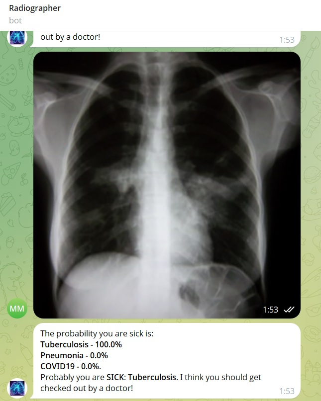

# Radiographer Telegram Bot

## Overview
Radiographer is an AI-powered Telegram bot designed for the automated diagnosis of lung diseases from chest X-ray images. Developed as part of the summer camp [КодИИм](https://xn--d1aiafni.xn--l1afu.xn--p1ai/), the bot employs a modified implementation of funtunde resnet50 to accurately detect tuberculosis, pneumonia, and COVID-19.

## Features
- Advanced deep learning model based on a modified funtunde resnet50 architecture.
- Diagnostic accuracy of 94% for lung disease detection.
- User-friendly interaction via Telegram for rapid medical evaluation.

## Usage (currently unavailable)
To use Radiographer, add the [LungsDiseasesDetectorBot](https://t.me/LungsDiseasesDetectorBot) on Telegram. Follow the on-screen instructions to submit your chest X-ray image and receive a detailed diagnostic report.

## Technical Details
- **Model Architecture:** funtunde resnet50 variant tailored for chest X-ray analysis.
- **Data Handling:** Pre-processed datasets ensure optimal model performance.
- **Dataset:** This project utilizes the dataset available at [Chest X-ray Pneumonia COVID-19 Tuberculosis](https://www.kaggle.com/datasets/jtiptj/chest-xray-pneumoniacovid19tuberculosis).
- **Performance:** Extensive testing has demonstrated a diagnostic accuracy of approximately 94%.

## Acknowledgments
We extend our gratitude to the organizers and participants of the summer camp [КодИИм](https://xn--d1aiafni.xn--l1afu.xn--p1ai/) for their invaluable support and contributions.

## Demonstration
Below is an example image demonstrating the bot in operation:

